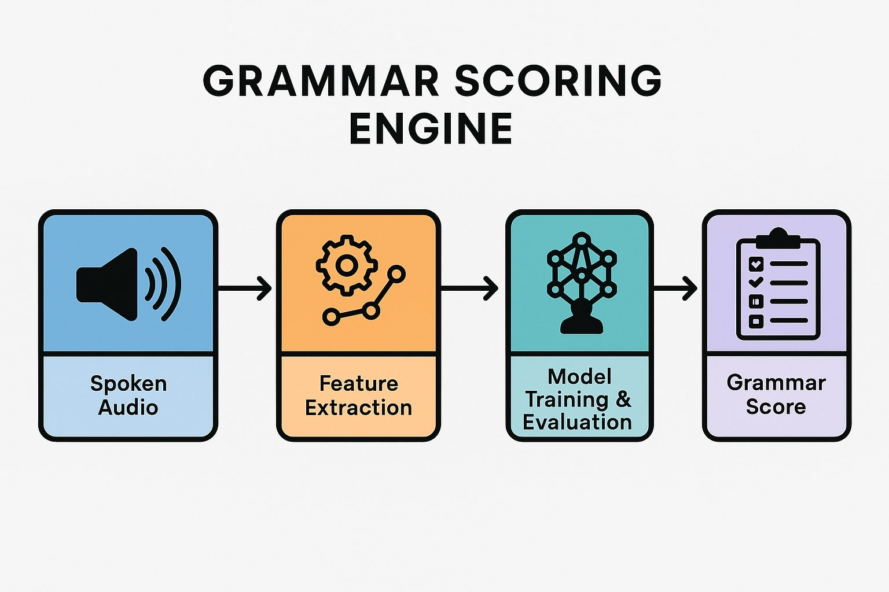

<p align="center">
  
</p>

<h1 align="center">Grammar Scoring Engine</h1>
<p align="center">A deep learning-powered system for evaluating grammar quality from spoken audio. A comprehensive framework for automatically scoring spoken-audio grammar on a 0–5 MOS Likert scale.</p>

The repository contains two Kaggle-style Jupyter notebooks:

* **`grammar-scoring-model-cnn.ipynb`**
  Implements a deep learning-based grammar scoring model using spectrograms of audio inputs. The notebook includes preprocessing via Mel spectrograms, training a Convolutional Neural Network (CNN), and evaluating the model with visualized performance metrics (loss plots, scatter plots of predictions).

* **`grammar-scoring-model-for-audios.ipynb`**
  Utilizes a traditional machine learning pipeline for grammar scoring. It extracts audio features (MFCCs, Chroma, etc.) using Librosa, conducts feature scaling and selection, and trains regression models such as Random Forest, XGBoost, and a simple feedforward Neural Network. Evaluation includes RMSE calculations and diagnostic plots like prediction vs. ground truth.

---

## 📂 Repository Structure

```
/
├── grammar-scoring-model-cnn.ipynb
├── grammar-scoring-model-for-audios.ipynb
├── data/                  # Audio files and CSV labels
│   ├── audios/train/
│   ├── audios/test/
│   ├── train.csv
│   └── test.csv
├── requirements.txt       # Python dependencies
└── README.md              # This file
```

## 🚀 Getting Started

### 1. Clone the repo

```bash
git clone https://github.com/deephabiswashi/audio-grammar-scorer.git
cd GrammarScoringEngine
```

### 2. Install dependencies

```bash
pip install -r requirements.txt
```

### 3. Prepare Data

Place your `.wav` files in `data/audios/train/` and `data/audios/test/`, and ensure `train.csv` and `test.csv` are in `data/`.

### 4. Run Notebooks

Open and execute the notebooks in sequence:

1. `grammar-scoring-model-cnn.ipynb` for the CNN-based approach.
2. `grammar-scoring-model-for-audios.ipynb` for the feature-based pipeline.

---

## 📋 Requirements

* Python 3.8+
* `librosa`, `pandas`, `numpy`, `scikit-learn`, `torch`, `tensorflow` (for NN variants), `xgboost`, `matplotlib`, `seaborn`, `transformers` (if using advanced models)

Install via:

```bash
pip install librosa pandas numpy scikit-learn torch tensorflow xgboost matplotlib seaborn transformers
```

---

## 🎯 Model Summary

### CNN-based Model (`grammar-scoring-model-cnn.ipynb`)

* Converts audio to Mel spectrograms.
* Builds a custom CNN architecture with Conv2D, BatchNorm, ReLU, MaxPool, and Dropout.
* Trains on labeled grammar MOS scores.
* Evaluates using RMSE and visual plots (loss, scatter).

### Feature-based Model (`grammar-scoring-model-for-audios.ipynb`)

* Extracts statistical and perceptual features using Librosa.
* Performs scaling, feature selection, and PCA.
* Trains and compares multiple regressors: RandomForest, XGBoost, MLP.
* Evaluates with RMSE, scatter plots, and model comparison.

---

## 🚧 Future Work

* Incorporate Transformer-based ASR embeddings.
* Multi-task learning for grammar and fluency jointly.
* Improve interpretability with SHAP/feature attribution.
